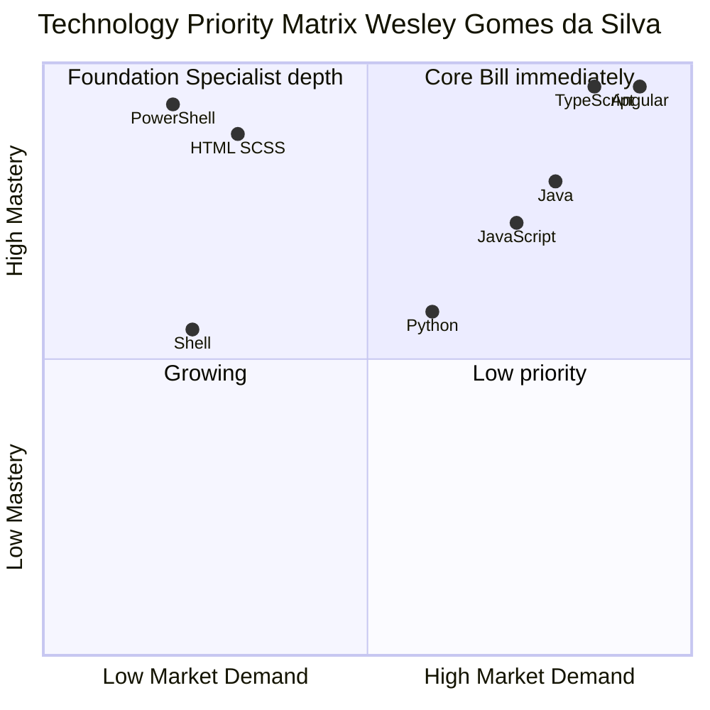

<h1 align="center">Wesley Gomes da Silva</h1>

<p align="center">
  <em>Nearshore Tech Lead · Angular · Java · AI-First Operating Model · UTC-3 · C2 English</em>
</p>

<p align="center">
  
  
  
  
  
</p>

<p align="center">
  <strong>→ Global positioning and business case: <a href="https://wesleyzilva.github.io/portfolioNearshoreWesIA/">wesleyzilva.github.io/portfolioNearshoreWesIA</a></strong>
</p>

---

## Global Portfolio

**[wesleyzilva.github.io/portfolioNearshoreWesIA](https://wesleyzilva.github.io/portfolioNearshoreWesIA/)** is the primary entry point for recruiters, clients, and partners evaluating a nearshore engagement. It contains:

- The competitive case for Brazilian nearshore vs. Eastern Europe, Asia, and LatAm alternatives
- The full business profile with verified operational metrics
- The engagement model and proposal structure
- An SEO-indexed hot-search page answering the questions that surface in real searches

This GitHub profile exists to provide the **evidence base** behind those claims — production code, deployment history, and project-level proof of the delivery record.

---

## The Brazilian Nearshore Case — Summary

Brazil at UTC-3 gives US clients full working-day overlap and EU clients a productive morning sync — without the 24-hour async cycle that makes offshore models expensive in practice. Senior engineers trained in Brazil's financial services and enterprise ecosystems match Central European technical depth at 40–60% lower cost than Western European rates.

| Dimension | Brazil (UTC-3) | Eastern Europe (UTC+2) | India / Asia (UTC+5.5) |
|-----------|---------------|----------------------|----------------------|
| **US working-day overlap** | Full | 3–4 hours | Near-zero |
| **EU morning overlap** | Full | Full | Partial |
| **Cost vs. Western EU** | 40–60% lower | 30–50% lower | 60–70% lower |
| **Enterprise Java / Angular depth** | Financial services scale | Strong | Variable at senior level |
| **C2 English at senior level** | Yes | Common | Variable |
| **Direct communication model** | Yes — ownership culture | Strong | High interpretation overhead |

> The differentiator is not being cheapest. It is being present — technically, linguistically, and culturally — when the architecture decision happens. That is what UTC-3 plus Brazilian enterprise depth produces.

**Full competitive argument → [Hot Search page](https://wesleyzilva.github.io/portfolioNearshoreWesIA/hot-search)**

---

## Why Wesley — The Case in Numbers

| Metric | Evidence |
|--------|----------|
| 14+ years | Leading technology and operational delivery across financial services and enterprise |
| 80M+ daily transactions | Data-intensive pipeline management with financial and regulatory impact |
| 90% vulnerability reduction | DevSecOps without a single sprint freeze |
| R$500M+ monthly | Reconciliation system ownership across distributed infrastructure |
| 3 continents | Distributed and nearshore team leadership in production |
| AI-first model | Documented AI workflow multiplying team throughput without proportional overhead increase |

**Full business profile → [Business Profile page](https://wesleyzilva.github.io/portfolioNearshoreWesIA/business-profile)**

---

## Technical Profile — Language Distribution Across All Repositories

Aggregated from production repositories as of May 2026:

| Language | Primary Use | Repos | Depth |
|----------|-------------|-------|-------|
| **TypeScript** | Angular applications (components, services, signals, routing) | 5 | ★★★★★ |
| **HTML** | Angular templates, SEO/schema.org, OG metadata | 5 | ★★★★★ |
| **SCSS** | Component styling, mobile-first design systems, animations | 5 | ★★★★☆ |
| **PowerShell** | Git automation, deployment pipelines, operational scripting | 6 | ★★★★★ |
| **JavaScript** | Node.js dispatch engines, client-side automation | 3 | ★★★★☆ |
| **Python** | Data processing, list generation, deployment orchestration | 2 | ★★★☆☆ |
| **Java** | Spring Boot REST APIs, Facade/Service/Persistence layers | 2 | ★★★★☆ |
| **Shell** | Linux deployment scripts, GitHub Actions pipelines | 1 | ★★★☆☆ |

---

## Technology Priority Matrix

> **How to read:** X axis = Market Demand. Y axis = My Mastery (depth in production projects).



### Quadrant Breakdown

| Quadrant | Technologies | Strategic meaning |
|----------|-------------|-------------------|
| **Core** (High Mastery + High Demand) | TypeScript · Angular · Java | Production-ready, billable immediately for global clients |
| **Foundation** (High Mastery + Specialist Demand) | PowerShell · HTML · SCSS | Critical operational depth; differentiator in DevOps-adjacent roles |
| **Growing** (Building Mastery + High Demand) | Python · JavaScript · Shell | Active in production projects; expanding depth with each release |

---

---

## Portfolio Projects — The Evidence Base

Each project below is a production deployment solving a real business problem. Together they are the verifiable foundation for the claims made on the [global portfolio site](https://wesleyzilva.github.io/portfolioNearshoreWesIA/). The breadth is deliberate: attribution engineering, data pipelines, compliance tooling, e-commerce, loyalty platforms, and the portfolio itself — each one a different dimension of the full-stack + nearshore-lead profile.

| Project | Problem Solved | Result | Stack |
|---------|---------------|--------|-------|
| [**dradaianaferraz_gold**](https://github.com/wesleyzilva/dradaianaferraz_gold) | Google Ads spend with no attribution to patient leads | Closed attribution loop: every WhatsApp click tracked in Google Ads Smart Bidding | Angular · GA4 · Google Ads |
| [**whatsappSenderHttp**](https://github.com/wesleyzilva/whatsappSenderHttp) | Dormant patient base with no systematic re-engagement | Automated reactivation pipeline with Customer Match export to Google Ads | Node.js · Python · PowerShell |
| [**portfolioNearshoreWesIA**](https://wesleyzilva.github.io/portfolioNearshoreWesIA/) ↗ | Senior engineers need live proof of full-stack craft for nearshore pitches | Production-deployed Angular portfolio with documented AI workflow — **this is the global positioning site** | Angular · Java · PostgreSQL |
| [**imprimaMais**](https://github.com/wesleyzilva/imprimaMais) | Direct importer invisible to B2B resellers | Professional storefront converting reseller intent into WhatsApp conversations | Angular · SCSS |
| [**restituicaoICMS_ISS_porIBS_front**](https://github.com/wesleyzilva/restituicaoICMS_ISS_porIBS_front) | R$500B in unreclaimed tax credits expiring due to 5-year prescriptive deadline | Self-service simulation + guided recovery wizard + Tax Reform impact projection | Angular · Tailwind |
| [**VIPpocket**](https://github.com/wesleyzilva/VIPpocket) | Paper loyalty cards get lost; no data on whether loyalty programmes work | QR-code digital card with 7-day cycle tracking; zero card-loss attrition | Angular · PWA |
| [**VIPpocket_adm**](https://github.com/wesleyzilva/VIPpocket_adm) | Loyalty programme operators can't measure ROI of their discounts | Per-customer LTV, frequency, average ticket, and programme cost dashboard | Angular |

---

## AI-Assisted Development Workflow

I integrate AI tooling as a first-class part of my engineering process — not as a shortcut, but as a documented, reproducible workflow:

```
Requirement → GitHub Copilot (inline scaffolding)
    └─► Component / service generated with correct patterns
             └─► Manual review: architecture, security, performance
                      └─► Copilot Chat: tradeoff analysis, refactoring options
                               └─► Commit: clean, attributable, production-ready
```

This workflow is visible across all repositories — every `git-manager.ps1`, every `README.md`, every Angular component follows the same documented standard.

---

## Engineering Principles

- **Attribution before optimisation** — measure before spending
- **Flat-file first** — avoid infrastructure until the problem requires it
- **Component contracts over convenience** — explicit inputs/outputs, OnPush everywhere
- **Tradeoffs documented** — every architectural decision is recorded with its rationale
- **Nearshore-ready by default** — English-first documentation, CI/CD, live demos

---

## Connect

- **Global Portfolio:** [wesleyzilva.github.io/portfolioNearshoreWesIA](https://wesleyzilva.github.io/portfolioNearshoreWesIA/) ← start here
- **GitHub:** [github.com/wesleyzilva](https://github.com/wesleyzilva) ← project evidence base
- **LinkedIn:** [linkedin.com/in/wesleyzilva](https://www.linkedin.com/in/wesleyzilva)
